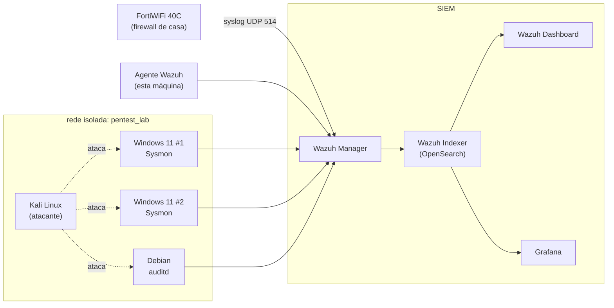

# 🛡️ soc-homelab

Laboratório de estudo para SOC (Security Operations Center), self-hosted
e 100% reproduzível via Ansible: SIEM, dashboards, ingestão de log de
rede real e um ambiente isolado de simulação de ataque.

Tudo aqui nasceu de uma regra simples: **nada é configurado manualmente**
— toda mudança no sistema vira uma role, e o playbook inteiro pode ser
reaplicado do zero numa máquina nova.

## 📸 Dashboard


## O que tem aqui

| Componente | Papel |
|---|---|
| **Wazuh** | SIEM — manager, indexer (OpenSearch) e dashboard, via Docker |
| **Grafana** | Dashboards de KPI conectados direto no indexer do Wazuh |
| **dnsmasq** | DNS local (`*.lab`) pros serviços do lab |
| **FortiWiFi 40C** | Firewall real de casa, logando via syslog pro Wazuh |
| **Kali Linux** | Atacante — CLI, ferramentas instaladas sob demanda |
| **Windows 11 × 2** | Alvos com Sysmon + agente Wazuh, via QEMU/KVM |
| **Debian (VM)** | Alvo Linux com `auditd` + agente Wazuh |

## Arquitetura



## Como reproduzir

```bash
git clone git@github.com:bendesDev/soc-homelab.git
cd soc-homelab
cp roles/grafana/vars/main.yml.example roles/grafana/vars/main.yml  # preencher com senhas reais
ansible-playbook site.yml -K
```

Idempotente: rodar de novo não deve reportar `changed` em nada que já
esteja no estado desejado.

## Roadmap

- [x] SIEM (Wazuh: manager + indexer + dashboard)
- [x] Agente Wazuh na própria máquina
- [x] Dashboards de KPI (Grafana)
- [x] Ingestão de log de dispositivo de rede real (FortiWiFi via syslog)
- [x] Infraestrutura de simulação de ataque (Kali + 2× Windows 11 + Debian)
- [ ] Rodar o Atomic Red Team contra os alvos
- [ ] SOAR (Shuffle + DFIR-IRIS), roteamento de alertas por severidade
- [ ] Threat intel (MISP, enriquecimento com VirusTotal/GeoIP)
- [ ] DFIR (Velociraptor)

## Documentação técnica

Comandos exatos, decisões de arquitetura e troubleshooting de cada
componente estão em [`docs/OPERATIONS.md`](docs/OPERATIONS.md) — inclui
coisas como por que o alvo Linux é uma VM e não um container, as
pegadinhas do datasource do Grafana, e o processo de troca de senha do
Wazuh.
